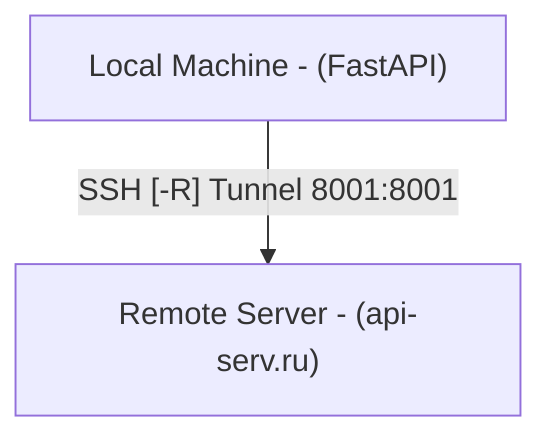

## Bash_Scripts_SSH

**📡 [SSH Tunnel & FastAPI Health Check](https://github.com/DmPanf/Bash_Scripts_SSH/blob/main/Port_Forwarding/README.md)**

```mermaid
graph TD
  LM["Local Machine - (FastAPI)"]
  RS["Remote Server - (api-serv.ru)"]
  LM -->|"SSH [-R] Tunnel 8001:8001"| RS
```
